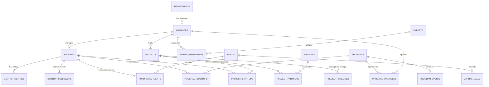

# 💾 데이터베이스 스키마 및 DDL 가이드 (0_db_schema.md)

본 문서는 **와이앤아처 데이터베이스 (PMS)** 시스템의 물리 데이터 모델 및 Supabase/PostgreSQL 기반의 DDL(Data Definition Language), RLS(Row Level Security) 정책을 상세히 정의합니다.

---

## 1. 개요 및 ERD 요약 및 테이블 관계 구조



---

## 2. 테이블 물리 명세 DDL (PostgreSQL)

다음 SQL 스크립트를 사용하여 Supabase SQL Editor에서 데이터베이스 스키마를 즉시 빌드할 수 있습니다.

> ⚠️ **베이스라인 안내**: 본 DDL 은 **초기 스키마(0001)** 기준입니다. 이후 마이그레이션(`0005`~)으로 추가/개편된 구조는 [PROGRESS.md](PROGRESS.md) 마이그레이션 표가 정본입니다. 특히 주요 구조 변경(2026-06-17):
> * **소속 계층 개편 — 회사 > 그룹 > 팀**(`0050`~`0053`): `departments`에 `company`(회사, 고정 3종) 추가, `teams`(팀, 소속 단위) 신설, `managers.team_id` 추가(팀 변경 시 `department_id` 자동 동기화). 상세 [11_departments.md](11_departments.md).
> * **담당자(다대다) 표준화**: `startup_managers`(`0038`)·`project_managers`(`0034`)·`fund_managers`(`0047`) 조인 도입(프로그램은 `program_managers` 기존). 책임자(`created_by`)는 트리거로 담당자에 자동 편입·해제 불가(`0048`/`0049`). 상세 [PATTERNS.md](PATTERNS.md) 17장.
> * **양방향 연계**(`0046` `program_partners` 등) 및 각 도메인 `created_by`·`updated_at`·`sections` 메타 컬럼 추가. 아래 DDL 에는 미반영.

```sql
-- 시스템 역할은 인사 직급(position)과 분리한다.
CREATE TYPE public.app_role AS ENUM ('admin', 'manager');

-- 1. 소속 본부 테이블 (departments)
CREATE TABLE public.departments (
    id UUID DEFAULT gen_random_uuid() PRIMARY KEY,
    name VARCHAR(100) NOT NULL UNIQUE,
    established_at DATE,
    description TEXT,
    leader_id UUID, -- 임시 허용 (Manager 생성 후 FK 연결)
    deleted_at TIMESTAMP WITH TIME ZONE,
    created_at TIMESTAMP WITH TIME ZONE DEFAULT timezone('utc'::text, now()) NOT NULL
);

-- 2. 심사역 테이블 (managers)
CREATE TABLE public.managers (
    id UUID PRIMARY KEY, -- auth.users.id 와 1:1 매핑
    name VARCHAR(50) NOT NULL,
    position VARCHAR(50) NOT NULL,
    role public.app_role DEFAULT 'manager' NOT NULL,
    profile_image_url TEXT,
    specialties TEXT[] DEFAULT '{}'::TEXT[] NOT NULL,
    biography JSONB DEFAULT '{"education": [], "career": []}'::JSONB NOT NULL,
    phone VARCHAR(20),
    email VARCHAR(100) UNIQUE NOT NULL,
    department_id UUID REFERENCES public.departments(id) ON DELETE SET NULL,
    deleted_at TIMESTAMP WITH TIME ZONE,
    created_at TIMESTAMP WITH TIME ZONE DEFAULT timezone('utc'::text, now()) NOT NULL
);

-- departments.leader_id 제약조건 설정 (순환 참조 대응)
ALTER TABLE public.departments 
ADD CONSTRAINT fk_departments_leader FOREIGN KEY (leader_id) REFERENCES public.managers(id) ON DELETE SET NULL;

-- 3. 스타트업 테이블 (startups)
CREATE TABLE public.startups (
    id UUID DEFAULT gen_random_uuid() PRIMARY KEY,
    name VARCHAR(100) NOT NULL,
    ceo_name VARCHAR(50) NOT NULL,
    logo_url TEXT,
    brand_color VARCHAR(7) DEFAULT '#515151',
    description TEXT,
    investment_stage VARCHAR(30) NOT NULL,
    shareholders JSONB DEFAULT '[]'::JSONB NOT NULL,
    manager_id UUID REFERENCES public.managers(id) ON DELETE SET NULL,
    deleted_at TIMESTAMP WITH TIME ZONE,
    created_at TIMESTAMP WITH TIME ZONE DEFAULT timezone('utc'::text, now()) NOT NULL,
    CONSTRAINT startups_brand_color_check CHECK (brand_color ~ '^#[0-9A-Fa-f]{6}$')
);

-- 4. 스타트업 시계열 성장 지표 테이블 (startup_metrics)
CREATE TABLE public.startup_metrics (
    id UUID DEFAULT gen_random_uuid() PRIMARY KEY,
    startup_id UUID REFERENCES public.startups(id) ON DELETE CASCADE NOT NULL,
    record_date DATE NOT NULL, -- 기록 기준일 (예: 분기별 스냅샷)
    valuation NUMERIC(15, 2) DEFAULT 0 NOT NULL, -- 기업 가치 (원화)
    revenue NUMERIC(15, 2) DEFAULT 0 NOT NULL, -- 최근 분기/연 매출 (원화)
    employee_count INTEGER DEFAULT 0 NOT NULL, -- 고용 인원수
    remarks TEXT,
    created_at TIMESTAMP WITH TIME ZONE DEFAULT timezone('utc'::text, now()) NOT NULL,
    UNIQUE (startup_id, record_date),
    CHECK (valuation >= 0),
    CHECK (revenue >= 0),
    CHECK (employee_count >= 0)
);

-- 5. 스타트업 후속 관리 및 보고서 제출 이력 (startup_followups)
CREATE TABLE public.startup_followups (
    id UUID DEFAULT gen_random_uuid() PRIMARY KEY,
    startup_id UUID REFERENCES public.startups(id) ON DELETE CASCADE NOT NULL,
    title VARCHAR(150) NOT NULL,
    report_type VARCHAR(30) NOT NULL, -- regular_quarterly, annual, risk_report 등
    reporting_period VARCHAR(20) NOT NULL, -- 예: 2026-Q2, 2026
    due_date DATE NOT NULL,
    file_url TEXT, -- 제출 파일 S3 경로
    is_submitted BOOLEAN DEFAULT false NOT NULL,
    submitted_at TIMESTAMP WITH TIME ZONE,
    milestones JSONB DEFAULT '[]'::JSONB NOT NULL, -- 마일스톤 달성 여부 리스트
    created_at TIMESTAMP WITH TIME ZONE DEFAULT timezone('utc'::text, now()) NOT NULL,
    UNIQUE (startup_id, report_type, reporting_period),
    CHECK (
        (is_submitted = false AND submitted_at IS NULL)
        OR (is_submitted = true AND submitted_at IS NOT NULL)
    )
);

-- 6. 프로그램 테이블 (programs)
CREATE TABLE public.programs (
    id UUID DEFAULT gen_random_uuid() PRIMARY KEY,
    name VARCHAR(150) NOT NULL,
    generation INTEGER DEFAULT 1 NOT NULL,
    budget NUMERIC(15, 2) DEFAULT 0 NOT NULL,
    start_date DATE NOT NULL,
    end_date DATE NOT NULL,
    recruitment_deadline DATE,
    description TEXT,
    deleted_at TIMESTAMP WITH TIME ZONE,
    created_at TIMESTAMP WITH TIME ZONE DEFAULT timezone('utc'::text, now()) NOT NULL,
    CHECK (start_date <= end_date),
    CHECK (recruitment_deadline IS NULL OR recruitment_deadline <= start_date),
    CHECK (budget >= 0)
);

-- 7. 프로그램 참여 매핑 조인 테이블 (program_startups)
CREATE TABLE public.program_startups (
    id UUID DEFAULT gen_random_uuid() PRIMARY KEY,
    program_id UUID REFERENCES public.programs(id) ON DELETE CASCADE NOT NULL,
    startup_id UUID REFERENCES public.startups(id) ON DELETE CASCADE NOT NULL,
    status VARCHAR(30) DEFAULT 'applied' NOT NULL, -- applied, screening, selected, completed, dropped
    created_at TIMESTAMP WITH TIME ZONE DEFAULT timezone('utc'::text, now()) NOT NULL,
    UNIQUE (program_id, startup_id),
    CHECK (status IN ('applied', 'screening', 'selected', 'completed', 'dropped'))
);

-- 8. 프로그램 운영 심사역 매핑 테이블 (program_managers)
CREATE TABLE public.program_managers (
    id UUID DEFAULT gen_random_uuid() PRIMARY KEY,
    program_id UUID REFERENCES public.programs(id) ON DELETE CASCADE NOT NULL,
    manager_id UUID REFERENCES public.managers(id) ON DELETE RESTRICT NOT NULL,
    role VARCHAR(30) DEFAULT 'operator' NOT NULL, -- lead, operator
    created_at TIMESTAMP WITH TIME ZONE DEFAULT timezone('utc'::text, now()) NOT NULL,
    UNIQUE (program_id, manager_id),
    CHECK (role IN ('lead', 'operator'))
);

-- 9. 프로그램 세부 일정 테이블 (program_events)
CREATE TABLE public.program_events (
    id UUID DEFAULT gen_random_uuid() PRIMARY KEY,
    program_id UUID REFERENCES public.programs(id) ON DELETE CASCADE NOT NULL,
    title VARCHAR(150) NOT NULL,
    event_type VARCHAR(30) NOT NULL, -- recruitment, demoday, networking, event
    event_date DATE NOT NULL,
    description TEXT,
    created_at TIMESTAMP WITH TIME ZONE DEFAULT timezone('utc'::text, now()) NOT NULL,
    -- system_events 동기화(16_aggregations.md) 시 제약 위반을 막기 위해 같은 허용 집합으로 제한한다.
    CHECK (event_type IN ('recruitment', 'demoday', 'networking', 'meeting', 'ir', 'event'))
);

-- 대시보드 공통 일정. 프로그램 외 협력 미팅, IR, 사내 일정을 함께 표현한다.
CREATE TABLE public.system_events (
    id UUID DEFAULT gen_random_uuid() PRIMARY KEY,
    title VARCHAR(150) NOT NULL,
    event_type VARCHAR(30) NOT NULL,
    event_date DATE NOT NULL,
    source_type VARCHAR(30), -- program, partner, startup, project, manual
    source_id UUID,
    description TEXT,
    created_by UUID REFERENCES public.managers(id) ON DELETE SET NULL,
    created_at TIMESTAMP WITH TIME ZONE DEFAULT timezone('utc'::text, now()) NOT NULL,
    CHECK (event_type IN ('recruitment', 'demoday', 'networking', 'meeting', 'ir', 'event')),
    -- program_events → system_events 동기화 트리거(16_aggregations.md 7장)의 ON CONFLICT 대상.
    -- 수동 일정은 source_id가 NULL이며, NULL은 UNIQUE에서 서로 충돌하지 않는다.
    UNIQUE (source_type, source_id)
);

-- 10. 펀드 테이블 (funds)
CREATE TABLE public.funds (
    id UUID DEFAULT gen_random_uuid() PRIMARY KEY,
    name VARCHAR(150) NOT NULL UNIQUE,
    total_amount NUMERIC(15, 2) NOT NULL,
    investing_period VARCHAR(100) NOT NULL,
    balance NUMERIC(15, 2) NOT NULL,
    lp_composition JSONB DEFAULT '[]'::JSONB NOT NULL,
    deleted_at TIMESTAMP WITH TIME ZONE,
    created_at TIMESTAMP WITH TIME ZONE DEFAULT timezone('utc'::text, now()) NOT NULL,
    CHECK (total_amount >= 0),
    CHECK (balance >= 0 AND balance <= total_amount)
);

-- 11. 캐피탈 콜 히스토리 테이블 (capital_calls)
CREATE TABLE public.capital_calls (
    id UUID DEFAULT gen_random_uuid() PRIMARY KEY,
    fund_id UUID REFERENCES public.funds(id) ON DELETE CASCADE NOT NULL,
    call_round INTEGER NOT NULL, -- 캐피탈 콜 차수 (예: 1, 2, 3)
    requested_amount NUMERIC(15, 2) NOT NULL, -- 요청액
    requested_date DATE NOT NULL,
    is_completed BOOLEAN DEFAULT false NOT NULL,
    completed_date DATE,
    created_at TIMESTAMP WITH TIME ZONE DEFAULT timezone('utc'::text, now()) NOT NULL,
    UNIQUE (fund_id, call_round),
    CHECK (call_round > 0),
    CHECK (requested_amount > 0),
    CHECK (
        (is_completed = false AND completed_date IS NULL)
        OR (is_completed = true AND completed_date IS NOT NULL)
    )
);

-- 12. 펀드 투자 집행 이력 조인 테이블 (fund_investments)
CREATE TABLE public.fund_investments (
    id UUID DEFAULT gen_random_uuid() PRIMARY KEY,
    fund_id UUID REFERENCES public.funds(id) ON DELETE RESTRICT NOT NULL,
    startup_id UUID REFERENCES public.startups(id) ON DELETE RESTRICT NOT NULL,
    investment_amount NUMERIC(15, 2) NOT NULL, -- 실제 출자액
    share_percentage NUMERIC(5, 2) NOT NULL, -- 취득 지분율 (%)
    investment_date DATE NOT NULL,
    created_at TIMESTAMP WITH TIME ZONE DEFAULT timezone('utc'::text, now()) NOT NULL,
    UNIQUE (fund_id, startup_id),
    CHECK (investment_amount > 0),
    CHECK (share_percentage >= 0 AND share_percentage <= 100)
);

-- 13. 외부 전문가 테이블 (experts)
CREATE TABLE public.experts (
    id UUID DEFAULT gen_random_uuid() PRIMARY KEY,
    name VARCHAR(50) NOT NULL,
    company VARCHAR(100) NOT NULL,
    position VARCHAR(50) NOT NULL,
    phone VARCHAR(20),
    email VARCHAR(100) UNIQUE NOT NULL,
    expert_type VARCHAR(30) NOT NULL, -- mentor, auditor, advisor
    specialties TEXT[] DEFAULT '{}'::TEXT[] NOT NULL,
    is_available BOOLEAN DEFAULT true NOT NULL,
    deleted_at TIMESTAMP WITH TIME ZONE,
    created_at TIMESTAMP WITH TIME ZONE DEFAULT timezone('utc'::text, now()) NOT NULL,
    CHECK (expert_type IN ('mentor', 'auditor', 'advisor'))
);

-- 14. 멘토링/자문 이력 테이블 (expert_mentorings)
CREATE TABLE public.expert_mentorings (
    id UUID DEFAULT gen_random_uuid() PRIMARY KEY,
    expert_id UUID REFERENCES public.experts(id) ON DELETE CASCADE NOT NULL,
    startup_id UUID REFERENCES public.startups(id) ON DELETE CASCADE NOT NULL,
    manager_id UUID REFERENCES public.managers(id) ON DELETE SET NULL, -- 입회/담당 심사역
    mentoring_date DATE NOT NULL,
    subject VARCHAR(200) NOT NULL,
    feedback TEXT,
    rating NUMERIC(2, 1) CHECK (rating >= 1.0 AND rating <= 5.0), -- 만족도 별점 (1.0~5.0)
    created_at TIMESTAMP WITH TIME ZONE DEFAULT timezone('utc'::text, now()) NOT NULL
);

-- 15. 프로젝트 테이블 (projects)
CREATE TABLE public.projects (
    id UUID DEFAULT gen_random_uuid() PRIMARY KEY,
    name VARCHAR(150) NOT NULL,
    project_type VARCHAR(30) NOT NULL, -- m_and_a, open_innovation
    stage VARCHAR(30) DEFAULT 'sourcing' NOT NULL, -- sourcing, register, review, meeting, proposal, contract, completed, canceled
    priority VARCHAR(10) DEFAULT 'medium' NOT NULL, -- high, medium, low
    start_date DATE NOT NULL,
    end_date DATE,
    description TEXT,
    manager_id UUID REFERENCES public.managers(id) ON DELETE SET NULL,
    deleted_at TIMESTAMP WITH TIME ZONE,
    created_at TIMESTAMP WITH TIME ZONE DEFAULT timezone('utc'::text, now()) NOT NULL,
    CHECK (project_type IN ('m_and_a', 'open_innovation')),
    CHECK (stage IN ('sourcing', 'register', 'review', 'meeting', 'proposal', 'contract', 'completed', 'canceled')),
    CHECK (priority IN ('high', 'medium', 'low')),
    CHECK (end_date IS NULL OR start_date <= end_date)
);

-- 16. 협력사 테이블 (partners)
CREATE TABLE public.partners (
    id UUID DEFAULT gen_random_uuid() PRIMARY KEY,
    name VARCHAR(150) NOT NULL UNIQUE,
    partner_type VARCHAR(30) NOT NULL, -- government, university, vc, corporation, partner
    contact_person VARCHAR(50) NOT NULL,
    phone VARCHAR(20),
    email VARCHAR(100),
    interaction_log JSONB DEFAULT '[]'::JSONB NOT NULL, -- 교류 협력 이력 로그 리스트
    deleted_at TIMESTAMP WITH TIME ZONE,
    created_at TIMESTAMP WITH TIME ZONE DEFAULT timezone('utc'::text, now()) NOT NULL,
    CHECK (partner_type IN ('government', 'university', 'vc', 'corporation', 'partner'))
);

-- 17. 프로젝트-스타트업 연계 조인 테이블 (project_startups)
CREATE TABLE public.project_startups (
    id UUID DEFAULT gen_random_uuid() PRIMARY KEY,
    project_id UUID REFERENCES public.projects(id) ON DELETE CASCADE NOT NULL,
    startup_id UUID REFERENCES public.startups(id) ON DELETE CASCADE NOT NULL,
    created_at TIMESTAMP WITH TIME ZONE DEFAULT timezone('utc'::text, now()) NOT NULL,
    UNIQUE (project_id, startup_id)
);

-- 18. 프로젝트-협력사 연계 조인 테이블 (project_partners)
CREATE TABLE public.project_partners (
    id UUID DEFAULT gen_random_uuid() PRIMARY KEY,
    project_id UUID REFERENCES public.projects(id) ON DELETE CASCADE NOT NULL,
    partner_id UUID REFERENCES public.partners(id) ON DELETE CASCADE NOT NULL,
    created_at TIMESTAMP WITH TIME ZONE DEFAULT timezone('utc'::text, now()) NOT NULL,
    UNIQUE (project_id, partner_id)
);

-- 19. 프로젝트 타임라인 로그 테이블 (project_timelines)
CREATE TABLE public.project_timelines (
    id UUID DEFAULT gen_random_uuid() PRIMARY KEY,
    project_id UUID REFERENCES public.projects(id) ON DELETE CASCADE NOT NULL,
    changed_date DATE DEFAULT CURRENT_DATE NOT NULL,
    from_stage VARCHAR(30) NOT NULL,
    to_stage VARCHAR(30) NOT NULL,
    changed_by UUID REFERENCES public.managers(id) ON DELETE SET NULL,
    remarks TEXT,
    created_at TIMESTAMP WITH TIME ZONE DEFAULT timezone('utc'::text, now()) NOT NULL,
    CHECK (from_stage <> to_stage)
);

-- 프로젝트 단계 변경과 타임라인 기록을 하나의 트랜잭션으로 보장한다.
CREATE OR REPLACE FUNCTION public.log_project_stage_change()
RETURNS TRIGGER
LANGUAGE plpgsql
SECURITY DEFINER
SET search_path = public
AS $$
BEGIN
    IF NEW.stage IS DISTINCT FROM OLD.stage THEN
        INSERT INTO public.project_timelines (
            project_id, changed_date, from_stage, to_stage, changed_by
        )
        VALUES (
            NEW.id, CURRENT_DATE, OLD.stage, NEW.stage, auth.uid()
        );
    END IF;
    RETURN NEW;
END;
$$;

REVOKE ALL ON FUNCTION public.log_project_stage_change() FROM PUBLIC;

CREATE TRIGGER projects_stage_audit_trigger
AFTER UPDATE OF stage ON public.projects
FOR EACH ROW
EXECUTE FUNCTION public.log_project_stage_change();
```

---

## 3. Row Level Security (RLS) 보안 정책

Supabase 클라이언트는 브라우저에서 직접 DB에 접근하므로, 모든 공개 스키마 테이블은 RLS를 활성화하고 명시적으로 허용된 작업만 열어야 합니다. 직급(`position`)이 아니라 시스템 역할(`role`)로 권한을 판단하며, Manager에게 `FOR ALL` 정책을 부여하지 않습니다.

### 3.1 전체 테이블 RLS 활성화

```sql
ALTER TABLE public.departments ENABLE ROW LEVEL SECURITY;
ALTER TABLE public.managers ENABLE ROW LEVEL SECURITY;
ALTER TABLE public.startups ENABLE ROW LEVEL SECURITY;
ALTER TABLE public.startup_metrics ENABLE ROW LEVEL SECURITY;
ALTER TABLE public.startup_followups ENABLE ROW LEVEL SECURITY;
ALTER TABLE public.programs ENABLE ROW LEVEL SECURITY;
ALTER TABLE public.program_startups ENABLE ROW LEVEL SECURITY;
ALTER TABLE public.program_managers ENABLE ROW LEVEL SECURITY;
ALTER TABLE public.program_events ENABLE ROW LEVEL SECURITY;
ALTER TABLE public.system_events ENABLE ROW LEVEL SECURITY;
ALTER TABLE public.funds ENABLE ROW LEVEL SECURITY;
ALTER TABLE public.capital_calls ENABLE ROW LEVEL SECURITY;
ALTER TABLE public.fund_investments ENABLE ROW LEVEL SECURITY;
ALTER TABLE public.experts ENABLE ROW LEVEL SECURITY;
ALTER TABLE public.expert_mentorings ENABLE ROW LEVEL SECURITY;
ALTER TABLE public.projects ENABLE ROW LEVEL SECURITY;
ALTER TABLE public.partners ENABLE ROW LEVEL SECURITY;
ALTER TABLE public.project_startups ENABLE ROW LEVEL SECURITY;
ALTER TABLE public.project_partners ENABLE ROW LEVEL SECURITY;
ALTER TABLE public.project_timelines ENABLE ROW LEVEL SECURITY;
```

### 3.2 역할 확인 헬퍼

정책 안에서 `managers`를 반복 조회할 때 발생할 수 있는 재귀 RLS를 피하기 위해, 역할 확인 함수는 별도 마이그레이션 소유자가 생성하고 일반 사용자에게 실행 권한만 부여합니다.

```sql
CREATE OR REPLACE FUNCTION public.current_user_role()
RETURNS public.app_role
LANGUAGE sql
STABLE
SECURITY DEFINER
SET search_path = public
AS $$
    SELECT role
    FROM public.managers
    WHERE id = auth.uid()
      AND deleted_at IS NULL
$$;

REVOKE ALL ON FUNCTION public.current_user_role() FROM PUBLIC;
GRANT EXECUTE ON FUNCTION public.current_user_role() TO authenticated;
```

### 3.3 CRUD별 정책 예시

스타트업처럼 Manager가 작성·수정할 수 있는 테이블은 `SELECT`, `INSERT`, `UPDATE`를 분리합니다. 클라이언트 `DELETE` 정책은 만들지 않으며, Manager가 `UPDATE`로 `deleted_at`을 설정하는 것도 차단합니다.

```sql
CREATE POLICY startups_select_authenticated
ON public.startups FOR SELECT TO authenticated
USING (deleted_at IS NULL);

CREATE POLICY startups_insert_staff
ON public.startups FOR INSERT TO authenticated
WITH CHECK (
    public.current_user_role() = 'admin'
    OR (
        public.current_user_role() = 'manager'
        AND deleted_at IS NULL
    )
);

CREATE POLICY startups_update_staff
ON public.startups FOR UPDATE TO authenticated
USING (
    deleted_at IS NULL
    AND public.current_user_role() IN ('admin', 'manager')
)
WITH CHECK (
    public.current_user_role() = 'admin'
    OR (
        public.current_user_role() = 'manager'
        AND deleted_at IS NULL
    )
);

-- 클라이언트 DELETE 정책은 만들지 않는다.
-- Admin의 일반 삭제도 UPDATE로 deleted_at을 기록한다.
```

펀드·부서처럼 Manager가 조회만 할 수 있는 테이블은 Admin 변경 정책만 둡니다.

```sql
CREATE POLICY funds_select_authenticated
ON public.funds FOR SELECT TO authenticated
USING (deleted_at IS NULL);

CREATE POLICY funds_insert_admin
ON public.funds FOR INSERT TO authenticated
WITH CHECK (public.current_user_role() = 'admin');

CREATE POLICY funds_update_admin
ON public.funds FOR UPDATE TO authenticated
USING (public.current_user_role() = 'admin')
WITH CHECK (public.current_user_role() = 'admin');

-- 펀드 역시 클라이언트 DELETE 정책을 만들지 않는다.
```

심사역은 전체 프로필을 조회하되 Manager 본인은 허용된 프로필 필드만 수정해야 합니다. RLS는 행 접근만 구분하므로 일반 클라이언트의 직접 `UPDATE`는 Admin만 허용하고, Manager 본인 수정은 `name`, `profile_image_url`, `specialties`, `biography`, `phone` 등 허용 컬럼만 갱신하는 `SECURITY DEFINER` RPC로 제공합니다. RPC 내부에서 반드시 `auth.uid()`와 대상 ID가 같은지 검증합니다.

```sql
CREATE POLICY managers_select_authenticated
ON public.managers FOR SELECT TO authenticated
USING (deleted_at IS NULL);

CREATE POLICY managers_update_admin
ON public.managers FOR UPDATE TO authenticated
USING (public.current_user_role() = 'admin')
WITH CHECK (public.current_user_role() = 'admin');
```

> [!IMPORTANT]
> 위 정책은 대표 패턴입니다. 실제 마이그레이션에는 2.2 권한 매트릭스에 따라 모든 테이블의 정책을 빠짐없이 작성해야 합니다. `project_timelines`는 사용자의 직접 `INSERT`를 허용하지 않고, 권한이 회수된 감사 Trigger 함수만 기록합니다. 정책이 없는 RLS 테이블은 기본적으로 접근이 거부되며, `service_role`을 프론트엔드에 노출해 이를 우회해서는 안 됩니다.

---

## 4. 데이터 정밀도 및 타입 설계 고려 사항
* **금액 및 지표 통계**: 펀드 총액(`total_amount`), 예산(`budget`), 기업 가치(`valuation`) 등 화폐 연관 데이터는 부동소수점 오차 방지를 위해 `NUMERIC(15, 2)`(십진수 정밀 타입)을 사용합니다.
* **약력 및 주주 이력**: 가변 구조를 지원하기 위해 JSONB 타입을 적극 채택하여, 학력/경력과 주주 목록 구성이 유연하게 확장될 수 있도록 설계하였습니다.
* **금액 범위**: 원화 단위의 대형 펀드와 누적 포트폴리오 가치를 고려하여 운영 규모가 `NUMERIC(15, 2)` 상한을 넘을 수 있으면 배포 전에 `NUMERIC(20, 2)` 이상으로 확장합니다.
* **상태 및 비율 검증**: 상태값은 Enum 또는 `CHECK`, 지분율은 `0~100`, 금액과 인원은 0 이상, 시작일은 종료일 이전이라는 제약을 DB에서 강제합니다.
* **펀드 잔액 정합성**: `funds.balance`를 수동 입력값으로 유지한다면 투자 집행 등록과 같은 트랜잭션에서 함께 갱신합니다. 더 엄격한 운영에서는 투자·비용 원장을 기준으로 계산하는 View를 사용합니다.
* **JSONB 사용 범위**: 약력처럼 가변적이고 독립 조회가 적은 데이터에만 JSONB를 사용합니다. 교류 이력, 주주 변동, LP 납입처럼 개별 검색·권한·감사가 필요한 데이터는 운영 단계에서 정규 테이블로 분리합니다.

## 5. 삭제 및 이력 보존 원칙

* 마스터 테이블의 일반 삭제는 `deleted_at`을 기록하는 소프트 딜리트로 처리합니다.
* 투자 집행, 멘토링, 후속 보고, 프로젝트 타임라인은 업무 증빙이므로 마스터가 비활성화되어도 보존합니다.
* 현재 일부 FK의 `ON DELETE CASCADE`는 개발 초기 매핑 정리를 위한 값입니다. 운영 마이그레이션에서는 이력 테이블을 `RESTRICT` 또는 비식별 보존 방식으로 전환하고, 하드 딜리트는 참조 관계를 검사하는 Admin 전용 서버 함수로만 수행합니다.
