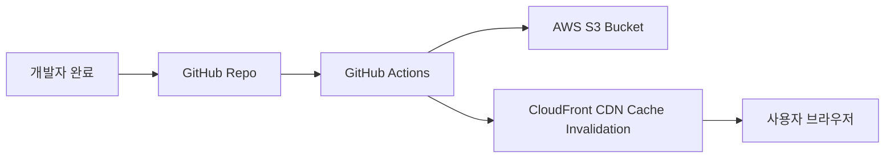

# 🚀 배포 및 CI/CD 파이프라인 가이드 (13_deployment.md)

본 문서는 **와이앤아처 데이터베이스 (PMS)** 프로젝트의 AWS S3 정적 호스팅 및 CloudFront CDN 배포 절차와 GitHub Actions를 이용한 지속적 통합/배포(CI/CD) 자동화 구성을 가이드합니다.

---

## 1. 배포 환경 인프라 구성 (AWS S3 + CloudFront)

사내 시스템의 가용성과 낮은 유지비용을 위해 **Serverless 정적 사이트 호스팅(React SPA)** 방식을 사용합니다.



### 1.1 AWS S3 버킷 설정
1. AWS S3 콘솔에서 버킷 생성 (예: `yna-pms-web`).
2. **객체 소유권**: `ACL 활성화` 또는 `권장 비활성화` (CloudFront OAI 연결 방식 사용).
3. **퍼블릭 액세스 차단 설정**: *모든 퍼블릭 액세스 차단* 활성화 (보안을 위해 S3 버킷은 비공개로 유지하고 CloudFront를 통해서만 웹접근을 허용합니다).

### 1.2 AWS CloudFront 배포 설정
1. CloudFront 배포를 신규 생성하고, S3 버킷을 원본(Origin)으로 지정합니다.
2. **Origin Access Control (OAC)** 설정을 생성하여 원본 버킷 정책을 업데이트합니다 (S3 버킷 정책에 CloudFront 원본 액세스 허용 구문 추가).
3. **뷰어 프로토콜 정책**: `Redirect HTTP to HTTPS` 설정.
4. **사용자 지정 오류 응답 (SPA 라우팅 대응)**:
   * SPA(React Router) 라우팅을 지원하기 위해 CloudFront **오류 페이지** 설정을 추가합니다.
   * `403 Forbidden` 및 `404 Not Found` 에러 발생 시, 응답 페이지 경로를 `/index.html`로 설정하고 응답 코드를 `200 OK`로 덮어씌웁니다.

---

## 2. 프론트엔드 환경 변수 명세 (.env.local)

로컬 개발 환경 및 빌드 단계에서 아래 환경변수가 필수적으로 설정되어야 합니다. 민감한 키 값은 절대 소스코드에 하드코딩하지 않습니다.

```bash
# Supabase 프로젝트 연동 키
VITE_SUPABASE_URL=https://your-project-id.supabase.co
VITE_SUPABASE_ANON_KEY=eyJhbGciOiJIUzI1NiIsInR5cCI6IkpXVCJ9...

# Edge Function 공개 엔드포인트를 별도로 사용할 경우
VITE_API_BASE_URL=https://your-project-id.supabase.co/functions/v1
```

> [!IMPORTANT]
> `VITE_` 접두사가 붙은 값은 빌드 결과물에 포함되어 브라우저에서 확인할 수 있습니다. Supabase `service_role`, AWS Access Key, OpenAI API Key 같은 비밀값에는 절대 `VITE_`를 붙이거나 프론트엔드 환경변수로 주입하지 않습니다.

### 2.1 서버측 비밀 변수

다음 값은 Supabase Edge Function Secrets 또는 서버 런타임 비밀 저장소에서만 관리합니다.

```bash
SUPABASE_SERVICE_ROLE_KEY=...
AWS_ACCESS_KEY_ID=...
AWS_SECRET_ACCESS_KEY=...
AWS_S3_BUCKET_NAME=yna-pms-attachments
AWS_REGION=ap-northeast-2
OPENAI_API_KEY=...
```

* **계정 생성 및 역할 변경**: Edge Function이 로그인 사용자와 Admin 역할을 검증한 후 Supabase Auth Admin API를 호출합니다.
* **첨부파일 업로드**: Edge Function이 사용자 권한, 파일 종류, 크기, 저장 경로를 검증한 후 짧은 만료시간의 S3 Presigned URL을 발급합니다. 브라우저에 AWS 자격 증명을 전달하지 않습니다.
* **AI 분석 요청**: Edge Function이 사용자의 DB 접근 범위를 검증하고 필요한 데이터만 조회한 뒤 AI API를 호출합니다. 모델 API 키와 `service_role`은 서버측에만 둡니다.
* **업로드 격리**: S3 객체 키는 사용자 또는 세션별 prefix를 사용하고, AI 임시 파일은 보존 기간 만료 시 Lifecycle Rule 또는 정리 작업으로 삭제합니다.

---

## 3. GitHub Actions CI/CD 워크플로우 템플릿

프로젝트 루트 폴더 아래 `.github/workflows/deploy.yml` 경로에 생성할 자동 배포 스크립트 규격입니다.

```yaml
name: YNA PMS Production Deploy

on:
  push:
    branches:
      - main # main 브랜치에 코드가 push/merge 될 때 배포 가동

jobs:
  build-and-deploy:
    runs-on: ubuntu-latest

    steps:
      # 1. 소스코드 체크아웃
      - name: Checkout Source Code
        uses: actions/checkout@v4

      # 2. Node.js 개발 환경 구성
      - name: Setup Node.js
        uses: actions/setup-node@v4
        with:
          node-version: 18
          cache: 'npm'

      # 3. 종속성 모듈 설치
      - name: Install Dependencies
        run: npm ci

      # 4. 환경 변수 파일 빌드 시점 생성
      - name: Generate Env File
        run: |
          echo "VITE_SUPABASE_URL=${{ secrets.VITE_SUPABASE_URL }}" >> .env
          echo "VITE_SUPABASE_ANON_KEY=${{ secrets.VITE_SUPABASE_ANON_KEY }}" >> .env
          echo "VITE_API_BASE_URL=${{ secrets.VITE_API_BASE_URL }}" >> .env

      # 5. React 프로젝트 빌드 (Vite)
      - name: Build Web App
        run: npm run build

      # 6. AWS CLI 자격 증명 설정
      - name: Configure AWS Credentials
        uses: aws-actions/configure-aws-credentials@v4
        with:
          aws-access-key-id: ${{ secrets.AWS_ACCESS_KEY_ID }}
          aws-secret-access-key: ${{ secrets.AWS_SECRET_ACCESS_KEY }}
          aws-region: ap-northeast-2

      # 7. S3 버킷으로 빌드 파일 동기화 배포
      - name: Synchronize S3
        run: aws s3 sync ./dist s3://${{ secrets.AWS_S3_BUCKET }} --delete

      # 8. CloudFront 캐시 무효화 (실시간 반영)
      - name: Invalidate CloudFront Cache
        run: |
          aws cloudfront create-invalidation \
            --distribution-id ${{ secrets.AWS_CLOUDFRONT_DISTRIBUTION_ID }} \
            --paths "/*"
```

> ⚠️ **GitHub Secrets 설정 사항**: 
> 배포 자동화를 위해 GitHub 리포지토리의 `Settings > Secrets and variables > Actions`에 위 워크플로우에서 호출하고 있는 Secrets 변수들을 반드시 사전 등록해 두어야 배포가 성공합니다.

## 4. 배포 보안 및 운영 체크리스트

- [ ] CloudFront 원본 접근은 레거시 OAI가 아닌 OAC를 기본으로 사용합니다.
- [ ] S3 웹 버킷과 첨부파일 버킷은 분리하고 모두 퍼블릭 액세스를 차단합니다.
- [ ] AWS 배포 권한은 장기 Access Key보다 GitHub Actions OIDC 역할 연동을 우선합니다.
- [ ] CloudFront에 보안 헤더 정책(CSP, HSTS, `X-Content-Type-Options`)을 연결합니다.
- [ ] Supabase Auth의 허용 Redirect URL과 CORS Origin을 운영 도메인으로 제한합니다.
- [ ] 빌드 전에 `npm run lint`, 타입 검사, 테스트를 실행하고 성공한 경우에만 배포합니다.
- [ ] DB 스키마 및 RLS 변경은 프론트엔드 배포와 분리된 마이그레이션 단계에서 먼저 검증합니다.
- [ ] SPA 라우팅의 403/404 → 200 변환이 API 또는 정적 자산 오류까지 숨기지 않는지 경로별로 확인합니다.
