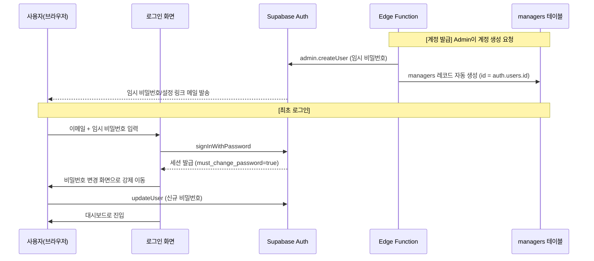

# 14. 인증 및 계정 관리 화면 (Auth & Account)

## 14.1 기능 정의 및 목적
* **목적**: 본 시스템의 모든 진입점인 로그인·세션 관리와, 관리자 생성제([2_policies.md](2_policies.md))를 실제로 수행하는 Admin 전용 계정 관리 화면을 정의합니다.
* **전제**: 자가 회원가입(Sign-up) 화면은 존재하지 않습니다. 모든 계정은 Admin이 발급합니다.

---

## 14.2 인증 플로우 (Authentication Flow)

* **세션 저장**: Supabase JS 클라이언트의 기본 `localStorage` 세션 + 자동 토큰 리프레시를 사용합니다. 세션은 Zustand의 `authStore`에 미러링하여 라우트 가드와 헤더 표시에 사용합니다.
* **최초 비밀번호 변경 강제**: 임시 비밀번호로 로그인한 계정은 `auth.users.user_metadata.must_change_password = true`로 표시하고, 이 플래그가 켜져 있으면 비밀번호 변경 화면 외 모든 라우트 접근을 차단합니다. 변경 성공 시 플래그를 해제합니다.
* **로그아웃**: 헤더 우상단 프로필 메뉴에서 `supabase.auth.signOut()` 호출 후 `authStore`를 초기화하고 `/login`으로 이동합니다.

---

## 14.3 화면 명세

### 14.3.1 로그인 화면 (`/login`)
* **구성**: 중앙 정렬 카드(`rounded-lg`, `max-w-sm`). 상단 브랜드 로고, 이메일 입력, 비밀번호 입력, "로그인" 버튼(`bg-yna-main hover:bg-yna-point`), 하단 "비밀번호를 잊으셨나요?" 링크.
* **검증**: 이메일 형식 검사, 빈 값 비활성화. 실패 시 인라인 얼럿("이메일 또는 비밀번호가 올바르지 않습니다.")으로 표시하고 상세 사유는 노출하지 않습니다(계정 존재 여부 비노출).
* **상태**: 제출 중 버튼 스피너 및 입력 비활성화. 이미 인증된 세션이 있으면 `/`(대시보드)로 리다이렉트.

### 14.3.2 최초 비밀번호 설정 화면 (`/onboarding/password`)
* **진입 조건**: `must_change_password = true`인 세션에서만 접근. 그 외 접근 시 대시보드로 리다이렉트.
* **구성**: 신규 비밀번호, 비밀번호 확인 입력. 정책 안내 인라인 텍스트.
* **비밀번호 정책**: 최소 10자, 영문 대/소문자·숫자·특수문자 중 3종 이상 조합. 실시간 충족 여부 체크리스트 표시.
* **완료**: 성공 시 `must_change_password` 해제 → 토스트("비밀번호가 설정되었습니다.") → 대시보드 이동.

### 14.3.3 비밀번호 재설정 (`/reset-password`)
* **요청 화면**: 이메일 입력 → `supabase.auth.resetPasswordForEmail`(운영 도메인 redirect URL 지정). 제출 후 "메일이 발송되었습니다(가입 여부와 무관하게 동일 문구)"로 응답해 계정 열거를 방지합니다.
* **재설정 화면**: 메일 링크의 recovery 토큰으로 진입 → 신규 비밀번호 입력(14.3.2 정책 동일) → 완료 후 로그인 화면 이동.

### 14.3.4 계정 관리 화면 (`/admin/accounts`, Admin 전용)
* **접근 제어**: `current_user_role() = 'admin'`이 아니면 라우트 가드가 403 화면으로 차단.
* **목록**: 전체 심사역 계정 테이블(이름, 이메일, 직급 `position`, 시스템 역할 `role`, 소속 본부, 상태[활성/비활성], 생성일). 비활성(`deleted_at IS NOT NULL`) 행은 회색 배지 표시. 검색/필터는 [17_conventions.md](17_conventions.md) 공통 규약을 따릅니다.
* **신규 계정 생성 모달**: 이름, 이메일, 직급, 소속 본부, 초기 역할(`admin`/`manager`) 입력 → "계정 생성" 클릭 시 **Edge Function `admin-create-user` 호출**. 성공 시 임시 비밀번호 메일 발송 안내 토스트. 브라우저에서 직접 `service_role`을 사용하지 않습니다.
* **역할 변경**: 행의 역할 드롭다운 변경 시 확인 모달 후 **Edge Function `admin-change-role` 호출**. 변경 전후 값·변경자·시각은 `audit_logs`([15_system_schema.md](15_system_schema.md))에 기록됩니다.
* **계정 비활성화(소프트 딜리트)**: 확인 모달 후 `managers.deleted_at` 기록. 즉시 목록·조회 화면에서 숨김 처리되며, 해당 계정의 세션은 다음 요청 시 RLS에 의해 데이터 접근이 제한됩니다.
* **영구 삭제(하드 딜리트)**: 별도 "데이터 정리" 탭에서, 담당 스타트업·프로젝트의 이관 완료를 검증하는 **Edge Function `admin-hard-delete-user`**를 통해서만 노출·실행합니다. 이관 미완료 시 버튼 비활성화 + 사유 표시.

---

## 14.4 Edge Function 명세 (서버측 전용)

| 함수명 | 입력 | 처리 | 권한 검증 |
| :--- | :--- | :--- | :--- |
| `admin-create-user` | name, email, position, department_id, role | `auth.admin.createUser` + `managers` insert(트랜잭션) + 임시 비밀번호 메일 | 호출자 role=admin 확인 |
| `admin-change-role` | target_id, new_role | `managers.role` 갱신 + `audit_logs` 기록 | 호출자 role=admin, 자기 자신 강등 방지 |
| `admin-hard-delete-user` | target_id | 참조 이관 검증 → 하드 딜리트 + `audit_logs` | 호출자 role=admin, 이관 완료 검증 |

* 위 함수는 모두 호출자 JWT를 검증하고, 내부에서 `service_role`로 권한 작업을 수행합니다. 키는 Edge Function Secrets에만 둡니다([13_deployment.md](13_deployment.md) 2.1).

---

## 14.5 권한 제어 요건 (RBAC)
* **로그인/비밀번호 화면**: 모든 미인증 사용자 접근 가능.
* **계정 관리 화면(`/admin/*`)**: Admin만 접근. Manager 접근 시 403 화면.
* **본인 프로필 수정**: 별도 화면이 아니라 [5_managers.md](5_managers.md)의 본인 상세 페이지에서 수행(`SECURITY DEFINER` RPC).
