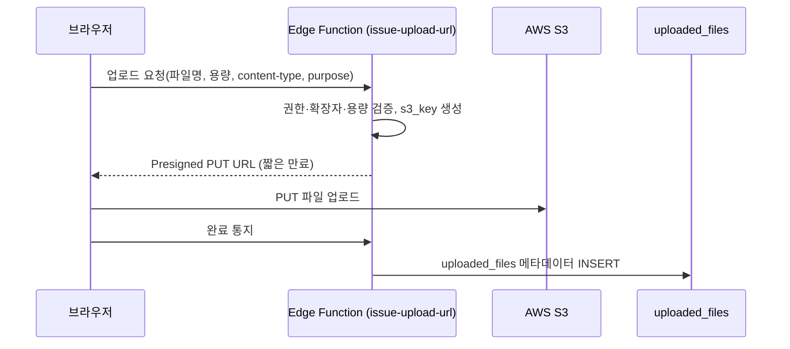

# 🧭 17. 공통 개발 규약 (17_conventions.md)

본 문서는 페이지마다 반복되는 **라우팅/IA, 목록(검색·필터·정렬·페이지네이션), 폼 검증, 파일 업로드** 패턴을 한 번만 정의해 9개 도메인 화면에서 동일하게 재사용하기 위한 규약입니다. [0_rules.md](0_rules.md)의 폴더 구조·500줄 규칙과 함께 적용합니다.

---

## 1. 라우팅 및 정보 구조 (Routing & IA)

React Router 기준 URL 체계입니다. 목록은 복수형, 상세는 `/:id`, 상세 내 탭은 쿼리스트링(`?tab=`)으로 표현합니다.

| 영역 | 경로 | 비고 |
| :--- | :--- | :--- |
| 로그인/온보딩 | `/login`, `/onboarding/password`, `/reset-password` | [14_auth.md](14_auth.md) |
| 대시보드 | `/` | 9대 도메인 요약 |
| 심사역 | `/managers`, `/managers/:id?tab=startups\|programs\|projects` | |
| 스타트업 | `/startups`, `/startups/:id?tab=metrics\|followups\|relations` | |
| 프로그램 | `/programs`, `/programs/:id?tab=calendar\|managers\|startups` | |
| 펀드 | `/funds`, `/funds/:id?tab=calls\|investments` | |
| 전문가 | `/experts`, `/experts/:id` | |
| 프로젝트 | `/projects`(칸반), `/projects/:id?tab=mapping\|timeline` | |
| 소속 | `/departments`, `/departments/:id` | |
| 협력사 | `/partners`, `/partners/:id` | |
| AI 파트너 | `/assistant`, `/assistant/:sessionId` | [3_smart_features.md](3_smart_features.md) |
| 계정 관리 | `/admin/accounts` | Admin 전용 |

* **레이아웃**: 모든 인증 라우트는 공통 셸([1_overview.md](1_overview.md): 사이드바 + 헤더) 안에 중첩됩니다. 미인증/온보딩 라우트는 셸 없이 단독 렌더링합니다.
* **라우트 가드**: `<RequireAuth>`(세션 필요) → `<RequireRole role="admin">`(Admin 전용) 순으로 감쌉니다. 권한 미달 시 403 화면 컴포넌트를 렌더링합니다.
* **딥링크**: 상세/탭은 URL로 직접 진입 가능해야 하며, 새로고침 시 상태가 복원됩니다.

---

## 2. 목록 공통 규약 (List Conventions)

모든 목록·테이블 화면은 아래 공통 동작을 `useListQuery` 훅(`src/hooks/`)으로 통일합니다.

* **검색**: 디바운스 300ms 텍스트 검색. 대상 컬럼은 페이지별로 지정(예: 스타트업=name·ceo_name, 협력사=name·contact_person). Supabase `ilike '%term%'` 사용.
* **필터**: 도메인별 주요 enum/태그 필터. 예) 스타트업 `investment_stage`, 프로젝트 `project_type`·`priority`, 전문가 `expert_type`·`specialties`(다중), 협력사 `partner_type`. 필터·검색·정렬·페이지 상태는 URL 쿼리스트링에 직렬화하여 공유·새로고침 가능하게 합니다.
* **정렬**: 기본 `created_at DESC`. 테이블 헤더 클릭으로 토글. 서버 정렬(`order`)을 기본으로 합니다.
* **페이지네이션**: 페이지당 20건 기본, Supabase `range()` 기반 서버 페이지네이션. 카드 그리드 화면은 "더 보기"/무한 스크롤, 표 화면은 페이지 번호를 사용합니다.
* **소프트 딜리트 제외**: 목록 쿼리는 항상 `deleted_at IS NULL`을 포함합니다(RLS SELECT 정책과 중복되어도 명시).
* **상태 표현**: 로딩=스켈레톤, 0건=Empty State + 권한 시 CTA, 오류=Toast([0_ui_ux.md](0_ui_ux.md) 1장).

---

## 3. 폼 검증 규약 (Form Validation)

* **라이브러리**: `react-hook-form` + `zod` 스키마. zod 스키마는 `src/schemas/`에 도메인별로 두고, 동일 스키마를 등록/수정 폼에서 재사용합니다.
* **검증 시점**: `onBlur` 1차 + 제출 시 전체 검증. 에러는 필드 하단 인라인 메시지(`text-yna-point text-xs`)로 표시합니다.
* **DB 제약과 정합**: zod 규칙은 [0_db_schema.md](0_db_schema.md)의 CHECK 제약을 그대로 반영합니다.

| 대상 | 규칙 |
| :--- | :--- |
| 이메일 | RFC 형식, 도메인 검증, 소문자 정규화 |
| 전화번호 | 숫자·하이픈만, 9~13자 |
| 금액(valuation/budget/total_amount 등) | 0 이상, 정수/소수 2자리, 천단위 콤마 표시·저장 시 숫자 |
| 지분율/소진율 | 0~100, 합계 100 초과 시 경고(주주·LP 구성) |
| 날짜 범위 | `start_date ≤ end_date`, 모집 마감일 ≤ 시작일 |
| HEX 컬러(brand_color) | `^#[0-9A-Fa-f]{6}$` |
| 별점(rating) | 1.0~5.0, 0.5 단위 |
| enum 필드 | DB CHECK와 동일한 허용값만 select 노출 |

* **제출 처리**: 모든 mutation은 `try-catch`로 감싸고 성공=Toast, 실패=Toast(치명적이면 Modal). 제출 중 버튼 비활성화·스피너.

---

## 4. 파일 업로드 규약 (File Upload)

브라우저는 AWS 자격증명을 갖지 않으며, 모든 업로드는 **Edge Function이 발급한 S3 Presigned URL**로 수행합니다([13_deployment.md](13_deployment.md), [15_system_schema.md](15_system_schema.md)).



* **용량/확장자 한도**:

| purpose | 허용 확장자 | 최대 용량 |
| :--- | :--- | :--- |
| `profile_image`, `startup_logo` | jpg, png, webp | 5 MB |
| `followup_report` | pdf, xlsx, docx, pptx | 50 MB |
| `ai_source` | pdf, xlsx, csv, txt | 30 MB |
| `partner_doc` | pdf, docx, hwp | 20 MB |

* **s3_key 규칙**: `{purpose}/{owner_id}/{uuid}-{sanitized_filename}`. AI 임시파일은 `ai_source/{owner_id}/{session_id}/...`로 세션 격리.
* **다운로드**: 비공개 버킷이므로 다운로드도 Edge Function이 발급하는 단기 Presigned GET URL로 제공합니다.
* **다운로드 로그**: 업로드 파일을 다운로드할 수 있는 모든 카드 섹션은 다운로드 요청을 서버에서 검증한 뒤 `file_download_logs`([15_system_schema.md](15_system_schema.md) 5장)에 기록합니다. 로그에는 다운로드한 사용자, 다운로드 시각, 파일, 원천 카드 섹션, 다운로드 목적을 반드시 포함합니다.
* **로그 노출 정책(현행)**: 다운로드 이력은 **DB(`file_download_logs`)에만 적재하고 화면(카드)에는 노출하지 않습니다.** 즉 감사 목적의 기록만 남기며, 사용자 화면에는 다운로드 이력 영역을 두지 않습니다. (추후 운영상 필요해지면 별도 관리자 화면에서 조회하도록 확장합니다.)
* **목적 입력**: 업무 파일 다운로드는 목적 선택 또는 간단한 사유 입력 후 진행합니다. 예: `투자 검토`, `보고서 제출 확인`, `LP/협력사 공유 준비`, `내부 백업`, `기타`. 선택/입력한 값은 `file_download_logs.download_purpose`에 저장합니다.
* **일괄 다운로드**: 여러 파일을 zip 등으로 묶어 다운로드할 때도 파일별 로그를 각각 남기며, 공통 목적과 묶음 식별자(`batch_id`)를 함께 저장합니다.
* **공통 '첨부파일' 카드(전 도메인 상세)**: 모든 게시글 상세에는 동일한 **첨부파일 카드**가 들어갑니다(임의 파일 업로드 + 개별/전체(zip) 다운로드). 저장은 별도 테이블 없이 `uploaded_files` 를 폴리모픽(`entity_type`/`entity_id`, `purpose='attachment'`)으로 재사용하고, 다운로드는 위 공통 규약(목적 입력 → 서명 URL → `file_download_logs` 기록)을 그대로 탑니다. **용량 제한은 두지 않습니다**(추후 S3 연동). 구현 표준은 [PATTERNS.md](PATTERNS.md) 16장.
* **만료/정리**: `ai_source`는 `expires_at`(기본 생성 후 7일)을 설정하고, S3 Lifecycle + 정리 작업이 원본·임베딩을 함께 파기합니다.

---

## 5. 공통 상태/유틸 위치

* `src/stores/`: Zustand 스토어(`authStore`, `uiStore` 사이드바 토글 등).
* `src/hooks/`: `useListQuery`, `useDashboardSummary`, 도메인별 `useStartups` 등 데이터 훅.
* `src/schemas/`: zod 검증 스키마.
* `src/lib/`: `supabaseClient`, 포맷터(통화·날짜·퍼센트), 상수(enum 라벨 매핑).
* **enum 라벨 매핑**: DB 영문 enum(`m_and_a`, `selected` 등)은 `src/lib/labels.ts`에서 한국어 라벨로 단일 매핑해 화면 전체에서 일관 표기합니다.

---

## 6. 공유 컴포넌트 — 사람 프로필 (Person Profile)

[5_managers.md](5_managers.md)(심사역)와 [9_experts.md](9_experts.md)(전문가)는 본질적으로 같은 **"사람 프로필"** 골격(이름·직급·연락처·이메일·전문분야 태그)을 공유합니다. **프레젠테이션 레이어는 공유하되, 데이터 테이블과 작성(mutation) 레이어는 분리**합니다.

### 6.1 테이블은 합치지 않는다
심사역은 내부 임직원(`id = auth.users.id`, 시스템 권한 `role`, 약력·소속 보유)이고 전문가는 외부 자문 풀(`company`, `expert_type`, `is_available`)이라 성격이 다릅니다. 합치면 nullable 컬럼 남발·RLS 충돌이 생기므로 `managers`·`experts` 테이블은 그대로 분리 유지합니다.

### 6.2 공유 타입 (`src/types/`)
공통 필드만 `BasePerson`으로 정의하고 각 도메인 타입이 확장합니다.

```typescript
interface BasePerson {
  id: string;
  name: string;
  position: string;
  phone: string;
  email: string;
  specialties: string[];
  deletedAt?: string;
  createdAt: string;
}
// Manager extends BasePerson + { role, profileImageUrl, biography, departmentId }
// Expert  extends BasePerson + { company, expertType, isAvailable }
```

### 6.3 공유 컴포넌트 (`src/components/common/person/`)
| 컴포넌트 | 역할 | 사용처 |
| :--- | :--- | :--- |
| `PersonProfileCard` | 이름·직급·연락처·이메일·전문분야 표시 카드 | 심사역/전문가 목록·상세 |
| `SpecialtyTags` | 전문분야 태그 칩 렌더 | 양쪽 + 검색 필터 |
| `SpecialtyFilter` | 전문분야 다중 선택 필터 | 양쪽 목록 화면 |
| `PersonFormFields` | 공통 입력 필드(이름·직급·연락처·이메일·전문분야) | 양쪽 폼에 합성, 도메인 고유 필드는 추가로 붙임 |

도메인 고유 요소(심사역 약력 에디터·프로필 이미지·소속 배지 / 전문가 회사·유형·가용 토글)는 공유 컴포넌트를 감싸 합성합니다.

### 6.4 작성 모델 차이 (Self vs Proxy) — 핵심
폼 *필드*는 공유하지만 **제출 경로와 권한 컨텍스트는 도메인별로 다릅니다.**

| 구분 | 심사역 (Manager) | 전문가 (Expert) |
| :--- | :--- | :--- |
| 입력 주체 | **당사자 본인**(self-service) | **직원 대리 입력**(proxy: Admin/Manager) |
| 로그인 계정 | 있음(`auth.users` 1:1) | 없음 |
| 제출 경로 | 본인 수정은 허용 컬럼만 갱신하는 `SECURITY DEFINER` RPC, 전체 수정은 Admin | Admin/Manager의 일반 `INSERT`/`UPDATE`(RLS) |
| 가용 상태 | 해당 없음 | `is_available` 토글을 직원이 관리 |
| 근거 | [5_managers.md](5_managers.md) 5.4, [0_db_schema.md](0_db_schema.md) 3.3 | [9_experts.md](9_experts.md) 9.4 |

* 따라서 폼 컴포넌트는 공유하되, 심사역 본인 편집 폼은 "내 프로필" 컨텍스트로 RPC를 호출하도록 감싸고, 전문가 폼은 직원 CRUD 권한 가드로 감쌉니다.

---

## 7. 상세 카드 섹션 표시/숨김 (Section Visibility)

모든 도메인 **상세 화면은 여러 카드 섹션**으로 구성됩니다(예: 스타트업 = 비즈니스·성장지표·주주·기업진단·뉴스룸·후속보고·메모). 도메인·대상마다 운영상 필요 없는 섹션이 다를 수 있으므로, **등록·기본 수정 폼에서 섹션별 표시/숨김을 토글**하고 상세 화면은 활성 섹션만 노출합니다. 이는 **전 도메인 공통 규약**입니다.

### 7.1 공통 규칙

* **프로필/식별 카드는 항상 표시**(이름·로고 등 핵심 정보) — 토글 대상에서 제외합니다.
* **'Phase 4 연동 예정' 플레이스홀더 Alert 는 토글 대상이 아닙니다**(실데이터 카드 섹션만 토글).
* 저장은 **섹션키→boolean 맵을 jsonb 한 컬럼(`sections`)** 으로 통째 보관합니다.
* 컬럼 default 는 **전체 표시** → 마이그레이션 적용 시 기존 행/신규 행 모두 기본은 전부 노출됩니다.
* **누락 키는 '표시'로 간주**(앱의 normalize) → 섹션을 추가해도 기존 행이 깨지지 않습니다(컬럼 불변, jsonb 키만 추가).
* 별도 화면 없이 **등록·기본 수정 동일 폼**에서 토글합니다.

### 7.2 권한

* 표시 설정 저장 권한 = 해당 도메인의 일반 수정 권한과 동일([PATTERNS.md](PATTERNS.md) 8장 매트릭스).
* **단, 심사역은 Admin 전용**입니다. 본인 수정 RPC(`update_my_profile`)는 허용 컬럼만 갱신하므로 `sections` 를 전송하지 않고, 폼은 admin 모드에서만 토글을 노출합니다(직급·소속과 동일 취급).

### 7.3 적용 현황

| 도메인 | 토글 가능한 보조 섹션 | 상태 |
| :--- | :--- | :--- |
| 스타트업 | 비즈니스&팀·성장지표·주주구성·기업진단·뉴스룸·후속보고·메모·**첨부파일**(8) | ✅ |
| 협력사 | 교류 협력 이력·**첨부파일**(2) | ✅ |
| 전문가 | 약력·소개·멘토링 만족도·**첨부파일**(4) | ✅ |
| 심사역 | 약력·소개·**첨부파일**(3, 토글은 **Admin 전용**) | ✅ |
| 소속(부서) | **첨부파일**(1) | ✅ (Phase 4 부서원/투자성과 블록 추가 시 키 확장) |
| 프로그램·펀드·프로젝트 | (상세 미구현) | **상세 구현 시 본 규약 + 첨부파일 카드 포함** |

* **첨부파일 카드**는 위 모든 도메인에 공통으로 들어가며(전 도메인 상세), 다른 섹션과 동일하게 `sections.attachments` 토글로 표시/숨김합니다. 카드 구현 자체는 [PATTERNS.md](PATTERNS.md) 16장(공통 `EntityFilesBlock`).

* 코드 구현 표준과 새 도메인 적용 절차는 [PATTERNS.md](PATTERNS.md) 15장을 따릅니다.
