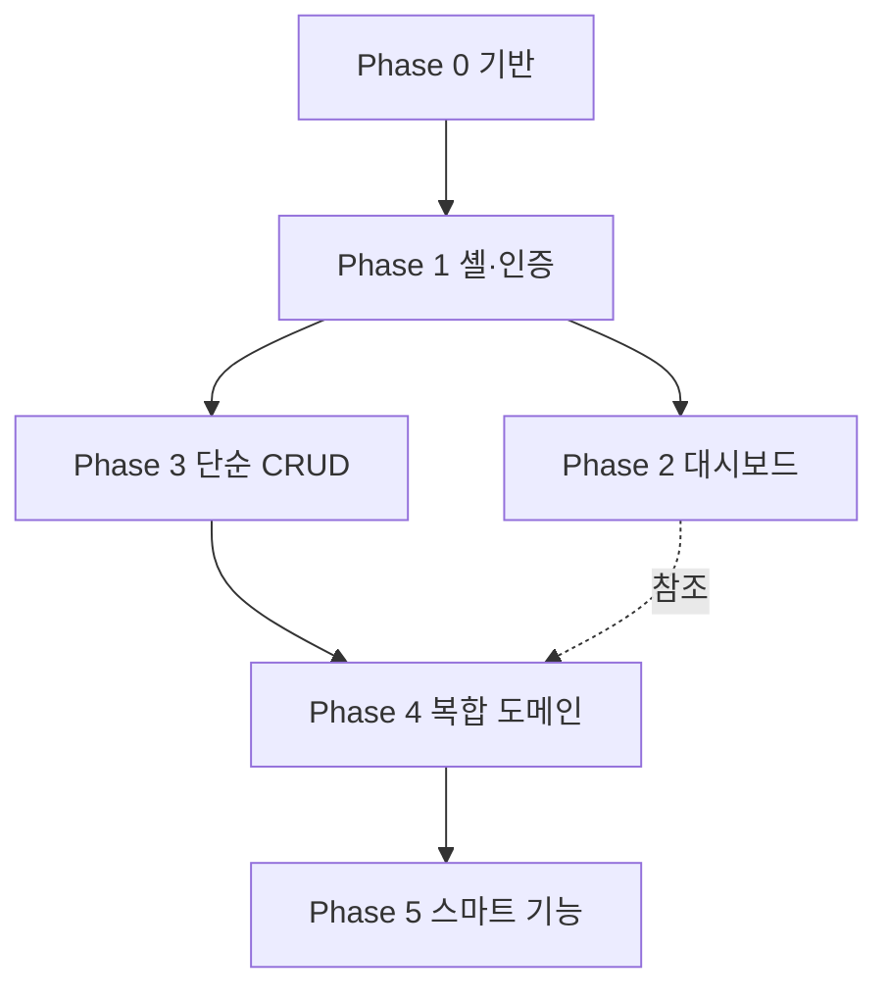

# 🗺️ 20. 개발 실행 로드맵 (20_roadmap.md)

본 문서는 흩어진 명세를 **순차 개발 대본**으로 묶은 실행 로드맵입니다. [19_bootstrap.md](19_bootstrap.md) 8장이 개요라면, 본 문서는 단계별 **완료 기준(DoD) · 선행 의존성 · 참조 문서 · AI 코딩 태스크 단위**를 제공합니다. 바이브 코딩 시 한 번에 한 태스크씩 지시하는 것을 권장합니다([0_rules.md](0_rules.md): 500줄·기능별 분할).

---

## 0. 사용법

* 각 Phase는 위에서 아래로 순서대로 진행합니다. **이전 Phase의 DoD를 만족하기 전에는 다음으로 넘어가지 않습니다.**
* 각 태스크는 "동사 + 산출물 + 위치" 형태로 쪼개 한 개씩 구현·검증합니다.
* 모든 Phase 종료 시 공통 검증 게이트(맨 아래 G장)를 통과해야 합니다.

---

## Phase 0 — 기반 구축 (Infra & Scaffold)
* **목표**: 빈 화면이라도 빌드·배포·DB 연결이 살아있는 상태.
* **선행**: 없음.
* **참조**: [19_bootstrap.md](19_bootstrap.md), [0_rules.md](0_rules.md), [0_design_system.md](0_design_system.md), [13_deployment.md](13_deployment.md)
* **태스크**:
  1. Vite+React+TS 프로젝트 생성, 의존성 설치([19_bootstrap.md](19_bootstrap.md) 1~2장).
  2. 폴더 구조 생성([19_bootstrap.md](19_bootstrap.md) 3장) + ESLint `max-lines:500`·Prettier 설정.
  3. Tailwind `yna` 토큰·Pretendard 폰트·AntD `ConfigProvider` 적용([0_design_system.md](0_design_system.md)).
  4. `src/lib/supabaseClient.ts` + `.env.local` 연결.
  5. DB 초기화 1~4단계 실행([19_bootstrap.md](19_bootstrap.md) 5장): 마스터/RLS/시스템 테이블/집계 View·Trigger.
  6. 최초 Admin 부트스트랩(콘솔 수동 1회) + 시드 투입.
* **DoD**: `npm run build` 성공 / Supabase에서 `get_dashboard_summary` 호출 시 JSON 반환 / S3+CloudFront 빈 페이지 배포 확인.

---

## Phase 1 — 공통 셸 & 인증 (Shell & Auth)
* **목표**: 로그인하면 사이드바·헤더가 있는 빈 셸로 들어오는 상태.
* **선행**: Phase 0.
* **참조**: [1_overview.md](1_overview.md), [14_auth.md](14_auth.md), [17_conventions.md](17_conventions.md), [2_policies.md](2_policies.md)
* **태스크**:
  1. `authStore`(Zustand) + Supabase 세션 동기화.
  2. 라우터 정의 + `<RequireAuth>` / `<RequireRole>` 가드([17_conventions.md](17_conventions.md) 1장).
  3. `AppShell`(사이드바 9메뉴 + 헤더 + 알림 종 배지 placeholder) — 컴포넌트 분할로 500줄 준수.
  4. 로그인 / 최초 비밀번호 설정 / 비밀번호 재설정 화면([14_auth.md](14_auth.md) 14.3).
  5. 공통 상태 컴포넌트: `Skeleton`, `EmptyState`, `ErrorToast`, `ConfirmModal`([0_ui_ux.md](0_ui_ux.md)).
* **DoD**: 시드 계정으로 로그인→대시보드 셸 진입 / 미인증 시 `/login` 리다이렉트 / Manager가 `/admin/accounts` 접근 시 403.

---

## Phase 2 — 대시보드 (읽기 전용)
* **목표**: 9대 도메인 요약 + 다가오는 일정이 실데이터로 표시.
* **선행**: Phase 1.
* **참조**: [4_dashboard.md](4_dashboard.md), [16_aggregations.md](16_aggregations.md)
* **태스크**:
  1. `useDashboardSummary` 훅 — `get_dashboard_summary(currentPeriod)` 호출.
  2. 3×3 도메인 카드 그리드 + 호버 인터랙션 + 각 상세 페이지 링크.
  3. 다가오는 일정 5건(`system_events`) 타임라인 섹션.
* **DoD**: 9개 카드가 시드 데이터 수치로 채워짐 / 카드 클릭 시 해당 메뉴로 이동 / 0건 도메인은 0으로 정상 표시.

---

## Phase 3 — 단순 CRUD 도메인
* **목표**: 관계가 단순한 도메인부터 목록·상세·등록/수정·소프트삭제 완성으로 **CRUD 패턴을 표준화**.
* **선행**: Phase 1(대시보드와 병행 가능).
* **참조**: [12_partners.md](12_partners.md), [9_experts.md](9_experts.md), [11_departments.md](11_departments.md), [5_managers.md](5_managers.md), [17_conventions.md](17_conventions.md), [2_policies.md](2_policies.md)
* **순서**: 협력사 → 전문가 → 소속(부서) → 심사역.
* **태스크(도메인마다 반복)**:
  1. `useListQuery` 기반 목록(검색·필터·정렬·페이지네이션) 화면([17_conventions.md](17_conventions.md) 2장).
  2. 상세 화면 + 연계 탭(해당 docs의 "연계 UI 블록").
  3. zod 스키마 + 등록/수정 폼([17_conventions.md](17_conventions.md) 3장).
  4. RBAC 적용: Manager 작성 가능 여부·삭제 차단을 화면과 RLS 양쪽에서 확인([2_policies.md](2_policies.md) 2.2).
  5. 도메인 특화 요소: 전문가 평점(`view_expert_ratings`), 부서 통계(`view_department_stats`), 심사역 본인 프로필 수정 RPC.
* **DoD**: 4개 도메인 모두 CRUD 동작 / Manager 계정으로 삭제 버튼 비노출·RLS 거부 확인 / 빈/로딩/에러 상태 표준 적용.

---

## Phase 4 — 복합 도메인
* **목표**: 시계열·매핑·캘린더·칸반 등 고난도 위젯 완성.
* **선행**: Phase 3(CRUD 패턴 확정).
* **참조**: [6_startups.md](6_startups.md), [7_businesses.md](7_businesses.md), [8_funds.md](8_funds.md), [10_projects.md](10_projects.md), [16_aggregations.md](16_aggregations.md)
* **순서·핵심 태스크** (발주자 요청으로 **프로젝트를 사업보다 앞당기고, 사업을 마지막**으로 조정, 2026-06-17):
  1. ✅ **스타트업**: 기본 CRUD → `startup_metrics` 시계열 차트(Recharts) → `startup_followups` 트래커 → 주주 파이차트. (+담당자 다대다 retrofit, 0038)
  2. ✅ **프로젝트**: CRUD → 담당자(다대다)·매칭 스타트업/협력사 매핑 패널 → 섹션 토글·첨부파일. **칸반/딜 파이프라인은 폐기**(단순 상태값 대기/진행중/완료/중단/취소), 유형=M&A·신사업·기타. 상세 [10_projects.md](10_projects.md).
  3. ✅ **펀드**: CRUD(Admin 전용) → 소진율 바·LP 도넛 → `capital_calls`·`fund_investments`. 섹션 토글·첨부. (0039~0041) + 스타트업 자사투자 ↔ 펀드 연동(0042).
  4. ✅ **사업**: CRUD → `business_events` FullCalendar(동기화 Trigger 동작) → 운영 심사역(다대다·역할)/참여 스타트업 매핑. 섹션 토글·첨부. (0043~0045)
  5. ✅ **양방향 연계**: 스타트업·심사역·협력사·소속 상세에 역방향 참조 패널(읽기, 마이그레이션 불필요).
  6. ✅ **매칭 프로그램**([21_matching_programs.md](21_matching_programs.md)): 부모 CRUD + `matching_applications`(스타트업×심사역×상태) 매핑 패널(팝업 폼). 사업+참여 스타트업 패턴 복제. (`0057`)
  7. ✅ **투자 자료실**([22_invest_archives.md](22_invest_archives.md)): 게시판형 CRUD(고정 공지·조회수 RPC·카테고리 필터) + 공통 첨부 카드. 수정/삭제=작성자 본인·Admin. (`0058`)
* **✅ 선결정 게이트 — 해결됨(2026-06-17)**: 담당 심사역을 **다대다로 확정**(책임자/담당자/관리자 3계층). 스타트업·프로젝트 모두 `*_managers` 조인 적용 완료(`view_department_stats` 등 집계 반영). 게시글 **삭제 권한 = 책임자+관리자**(프로젝트 적용), **수정 권한 축소**는 보류 유지. 상세 [6_startups.md](6_startups.md) 6.5.
* **DoD**: 시계열 차트가 record_date 순으로 렌더 / 담당자 다대다 배정 동작 / business_events 등록이 대시보드 일정에 반영 / 펀드 작성은 Admin만.

---

## Phase 5 — 스마트 기능
* **목표**: PPTX 추출 + AI 대화형 파트너.
* **선행**: Phase 4(스타트업 데이터 완성).
* **참조**: [18_pptx_spec.md](18_pptx_spec.md), [3_smart_features.md](3_smart_features.md), [15_system_schema.md](15_system_schema.md), [17_conventions.md](17_conventions.md) 4장
* **태스크**:
  1. **PPTX**: `src/lib/pptx/` 분할 구조 → 스타트업 상세 "보고서 출력" 버튼 → 4슬라이드 생성([18_pptx_spec.md](18_pptx_spec.md)).
  2. **파일 업로드 파이프라인**: `issue-upload-url` Edge Function + Presigned 업/다운로드 + `uploaded_files` 기록([17_conventions.md](17_conventions.md) 4장).
  3. **AI 파트너**: 대화 UI(`/assistant`) → 문서 업로드/임베딩(Edge Function) → `match_document_chunks` RAG + DB 교차 조회 → 응답·인용 표시 → 세션/메시지 저장([15_system_schema.md](15_system_schema.md)).
  4. **알림**: `notifications` 생성 Trigger(후속보고 기한·단계변경) + 헤더 배지 실데이터 연결.
* **DoD**: 편집 가능한 PPTX 다운로드(텍스트/표/네이티브 차트, Pretendard) / AI가 업로드 문서+DB를 근거로 답변·출처 표기 / 임시파일 만료 정리 동작 / 배지 카운트 정확.

---

## Phase 6 — 생산성 관리 (담당자 참여율) · **미구현(설계만)**

* **상태**: 발주자 확정(2026-06-21) — **기능 미구현**. 본 절은 향후 구현을 위한 설계 메모이며, 현재 코드/DB에는 반영하지 않는다.
* **목표**: 사업·M&A·신사업(프로젝트)의 **담당자별 업무 투입 비중(참여율)** 을 기록해, 추후 **이익 × 참여율**로 **인당 생산량**을 산출한다.
* **선행**: Phase 4(담당자 다대다 배정 = `business_managers` / `project_managers`, 공용 패널 `EntityManagersPanel`), 매출/이익 구조화(0060).
* **UX(설계)**:
  1. 담당자 연동(배정) **이후**, 상세의 담당자 카드 섹션 안에 **'참여율 부여'** 컨트롤을 둔다. 연동된 구성원 각각에 대해 참여율(%)을 부여한다.
  2. 참여율 부여 시 **해당 투입의 진행 기간(시작~종료일)** 을 함께 부여한다. 통계는 **월 단위**로 환산해 계산할 예정(기간을 월로 분해 → 월별 인당 생산량).
* **불변(중요) 규칙**:
  * 한 번 부여한 **참여율·기간은 잠금(immutable)** — **관리자(Admin)** 를 제외하고는 **작성자(책임자)도 수정 불가**.
  * 의도: 작성자가 임의로 업무 투입 비중을 조정해 생산량을 조작하는 것을 방지. 즉 **대표 승인(Admin) 없이는 담당자 변경·추가 및 참여율 변경 불가**.
* **데이터 모델(예상)**: `*_managers` 조인(또는 별도 `*_manager_allocations`)에 `participation_rate`(0~100), `period_start`/`period_end`(DATE), `locked`(BOOLEAN, 부여 즉시 true) 컬럼 추가. 잠금 해제·수정은 Admin 전용 RLS로 게이트.
* **산출(예상)**: 월별 `이익 × (참여율/100)`을 담당자별로 분배 → `인당 생산량` 집계 View. 대시보드/심사역 상세에 노출.
* **DoD(향후)**: 참여율·기간 부여 후 작성자 계정에서 수정 불가(Admin만 가능) / 월 단위 인당 생산량 집계가 이익·참여율과 정합.

---

## G. 공통 검증 게이트 (모든 Phase 종료 시)

[13_deployment.md](13_deployment.md) 4장과 연동합니다.

```bash
npm run lint && npm run typecheck && npm run test && npm run build
```

* [ ] 모든 소스 파일 500줄 이하([0_rules.md](0_rules.md)).
* [ ] 신규 화면에 로딩(스켈레톤)·빈 화면·에러 상태 적용([0_ui_ux.md](0_ui_ux.md)).
* [ ] 신규 테이블/기능의 RBAC를 Admin·Manager 두 계정으로 교차 검증([2_policies.md](2_policies.md)).
* [ ] 모든 Supabase 호출에 `try-catch` + 사용자 피드백([0_rules.md](0_rules.md) 3장).
* [ ] 비밀키가 `VITE_`로 노출되지 않음, 민감 작업은 Edge Function 경유([13_deployment.md](13_deployment.md)).

---

## 의존성 요약 (한눈에)


