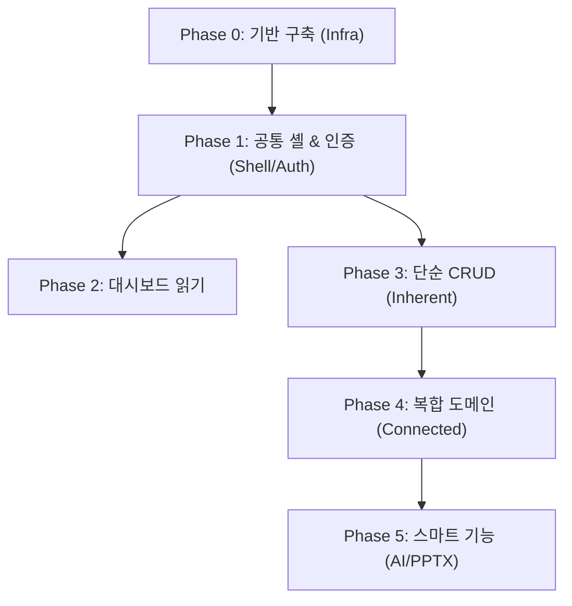

# 📂 와이앤아처 데이터베이스 기획 및 개발 표준 문서 목록

이 폴더는 **와이앤아처 데이터베이스** 시스템 구축을 위한 개발 단위 표준 명세서들이 위치한 곳입니다. 개발자는 각 단위 기능을 구현할 때 해당 문서의 데이터 모델 및 화면 요건을 참고하여 개발을 진행해야 합니다.

> [!IMPORTANT]
> **개발 표준 수칙**: 모든 코드 구현은 반드시 **[0_rules.md](0_rules.md)**의 아키텍처 규칙 및 파일당 최대 500줄 코딩 규격을 엄격히 준수해 주십시오.

> [!IMPORTANT]
> **실제 개발 진행 순서 (중요)**:
> 문서 번호(1~20)는 단순 문서 식별 번호이며, **순차 개발을 의미하지 않습니다.**
> 실제 개발은 **[20_roadmap.md](20_roadmap.md)**의 Phase 단위 로드맵에 맞추어 진행해주시기 바랍니다.

---

## 🗺️ 실제 개발 진행 순서 (Phase별 요약)

각 개발 단계별 핵심 수행 내용과 관련 명세 문서의 맵핑입니다. 자세한 완료 기준(DoD)은 **[20_roadmap.md](20_roadmap.md)**를 참조하십시오.

1. **Phase 0 — 기반 구축 (Infra & Scaffold)**
   * *내용*: 프로젝트 생성, 환경변수 및 Supabase 연결, 데이터베이스 물리 스키마 및 초기 시드 데이터 투입
   * *관련 문서*: [0_db_schema.md](0_db_schema.md), [0_design_system.md](0_design_system.md), [19_bootstrap.md](19_bootstrap.md)
2. **Phase 1 — 공통 셸 & 인증 (Shell & Auth)**
   * *내용*: 로그인 세션(Zustand), 권한 가드 라우터, 공통 사이드바/헤더 레이아웃, 공통 UI 피드백 컴포넌트
   * *관련 문서*: [0_ui_ux.md](0_ui_ux.md), [1_overview.md](1_overview.md), [14_auth.md](14_auth.md), [17_conventions.md](17_conventions.md)
3. **Phase 2 — 대시보드 (읽기 전용)**
   * *내용*: 9대 도메인 현황 요약 카드(집계 RPC 호출) 및 다가오는 일정 타임라인
   * *관련 문서*: [4_dashboard.md](4_dashboard.md), [16_aggregations.md](16_aggregations.md)
4. **Phase 3 — 단순 CRUD 도메인 (고유 블록 우선)**
   * *내용*: 검색/필터/정렬/페이지네이션 및 기본 CRUD, RLS 정책 적용 (협력사 → 전문가 → 소속 → 심사역)
   * *관련 문서*: [12_partners.md](12_partners.md), [9_experts.md](9_experts.md), [11_departments.md](11_departments.md), [5_managers.md](5_managers.md)
5. **Phase 4 — 복합/연계 도메인 (연계 블록)**
   * *내용*: 다대다 매핑, 시계열 차트, 캘린더, 칸반 보드 등 컴포넌트 중심의 복합 도메인 기능 (스타트업 → 사업 → 펀드 → 프로젝트)
   * *관련 문서*: [6_startups.md](6_startups.md), [7_businesses.md](7_businesses.md), [8_funds.md](8_funds.md), [10_projects.md](10_projects.md)
6. **Phase 5 — 스마트 기능 (AI & 보고서)**
   * *내용*: PptxGenJS 보고서 생성, Edge Function 파일 업로드, AI RAG 챗봇 및 실시간 알림
   * *관련 문서*: [3_smart_features.md](3_smart_features.md), [15_system_schema.md](15_system_schema.md), [18_pptx_spec.md](18_pptx_spec.md)

---

## 📌 문서 전체 목차

### ⚙️ 공통 및 표준 규격
*   **[0. 개발 표준 규칙](0_rules.md)**: 사용 기술 스택 명세 및 소스코드 작성 원칙
*   **[0. 디자인 시스템 정의](0_design_system.md)**: Pretendard 폰트 및 브랜드 컬러 규격
*   **[0. 데이터베이스 물리 스키마 정의](0_db_schema.md)**: Supabase 및 PostgreSQL 물리 테이블 DDL 및 RLS 정책
*   **[0. 공통 UI/UX 상태 및 레이아웃 가이드](0_ui_ux.md)**: 로딩/빈 화면/오류 상태 처리 및 간격 규격 표준
*   **[1. 서비스 개요 및 공통 레이아웃](1_overview.md)**: 플랫폼 개요, 비전 및 사이드바/헤더 레이아웃
*   **[2. 사용자 계정 및 권한 정책](2_policies.md)**: 관리자 생성제 및 역할 기반 권한 제어(RBAC)
*   **[3. 지능형 스마트 업무 기능 요건](3_smart_features.md)**: PPTX 다운로드 기능 및 AI 대화형 파트너(Agent) 요건

### 🧩 개발 단위 기능별 명세
*   **[4. 대시보드](4_dashboard.md)**: 통합 지표 정보 요약 카드 및 누적 성장 트렌드 차트
*   **[5. 심사역 관리](5_managers.md)**: 심사역 상세 프로필, 전문 분야 태그 및 담당 정보 탭
*   **[6. 스타트업 관리](6_startups.md)**: 스타트업 기업 정보 카드 뷰, 시계열 지표 및 후속 보고(Follow-up)
*   **[7. 사업 관리](7_businesses.md)**: AC 사업 일정 캘린더 및 보육 참여 기업 매핑
*   **[8. 펀드 관리](8_funds.md)**: 운용자산(AUM), LP 비율, Capital Call 및 출자 비율
*   **[9. 전문가 관리](9_experts.md)**: 외부 자문 풀 조회, 멘토링 만족도/별점 및 피드백 리스트
*   **[10. 프로젝트 관리](10_projects.md)**: M&A 딜/오픈이노베이션 단계별 칸반 보드 및 타임라인
*   **[11. 소속 관리](11_departments.md)**: 본부별 리소스 현황 및 담당 스타트업 총합 가치 비교
*   **[12. 협력사 관리](12_partners.md)**: 대외 네트워크 파트너사 목록 및 공동 프로젝트 기여도
*   **[13. 배포 및 CI/CD 가이드](13_deployment.md)**: AWS S3+CloudFront 인프라 구축 및 GitHub Actions 자동화 배포 가이드
*   **[21. 매칭 프로그램 관리](21_matching_programs.md)**: 지원사업(TIPS, LIPS 등) 현황 관리 및 보육 기업 신청/선정/매칭 이력 모니터링
*   **[22. 투자 자료실](22_invest_archives.md)**: 공통 서식, 템플릿, 시장분석 보고서 등 게시판형 투자 업무 자료 공유 기능

### 🔧 시스템·운영 보강 명세
*   **[14. 인증 및 계정 관리 화면](14_auth.md)**: 로그인/온보딩/비밀번호 재설정 화면 및 Admin 계정 관리·Edge Function 플로우
*   **[15. 시스템·운영 테이블 스키마](15_system_schema.md)**: 알림, 감사 로그, AI 대화 세션, 업로드 파일, 문서 임베딩 테이블 DDL 및 RLS
*   **[16. 집계 View·RPC 및 이벤트 동기화](16_aggregations.md)**: 대시보드/통계 집계 정의 및 business_events→system_events 동기화
*   **[17. 공통 개발 규약](17_conventions.md)**: 라우팅/IA, 목록(검색·필터·정렬·페이지네이션), 폼 검증, 파일 업로드 표준
*   **[18. PPTX 보고서 데이터 매핑](18_pptx_spec.md)**: 슬라이드별 데이터 소스 매핑 및 PptxGenJS 생성 규격
*   **[19. 프로젝트 부트스트랩 가이드](19_bootstrap.md)**: 초기 스캐폴드, 의존성, 폴더 구조, 시드, 품질 게이트 및 개발 순서
*   **[20. 개발 실행 로드맵](20_roadmap.md)**: Phase별 완료 기준·의존성·참조 문서·AI 코딩 태스크 단위 순차 개발 대본
